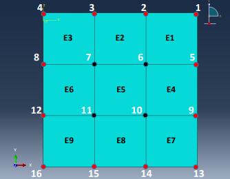
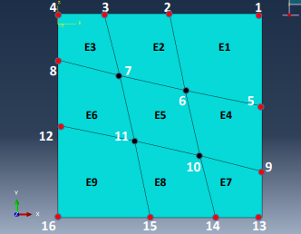
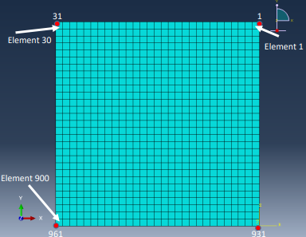
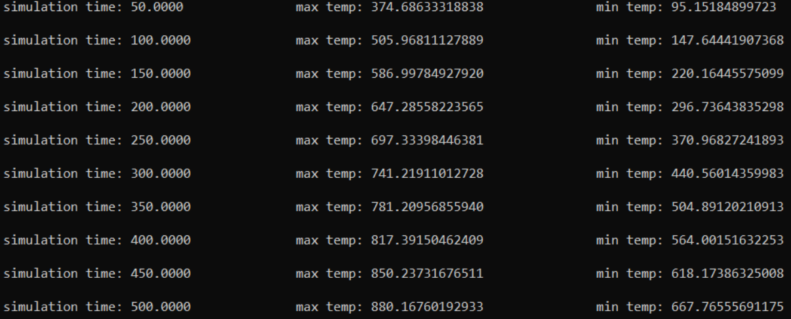

# Finite Element Method (Metoda Elementów Skończonych)
A program that implements the Finite Element Method in C++

The Finite Element Method is a method of approximating solutions to partial differential equations. It involves dividing the subject of study into a grid composed of finite elements. Each element has nodes for which differential equations must be calculated. Here, the FEM has been applied to approximate thermal processes.

Example grids used for calculations:

1.      2.  
3. 

The calculation results of the program for the grids described in the text files in the source folder:

Test1_4_4.txt (1):

Test2_4_4_MixGrid.txt (2):

Test3_31_31_kwadrat.txt (3):

